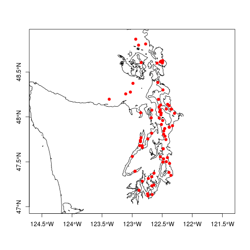

## Introduction

1. [Polychlorinated biphenyl](en.wikipedia.org/wiki/Polychlorinated_biphenyl) (PCB) is a synthetic organic chemical compound with similar structure to dioxin
2. Research has revealed that PCBs may be harmful to human being
3. Environment survey could tell us the distribution and fate of PCBs in envronmental samples
4. In this work, I will show you the relationship explore between PCBs concentration and some environmetal factors like the sample depth, the amount of organic material(TOC), The total silt and clay fraction (TF)
5. Data were got from [U.S. EPA](http://www.epa.gov/pugetsound/bold.html)

---

## Sampling

- The Sediment sampling were down in the summer of 2008
- Here is the sampling map

 

---

## Relationship Explore

- Here the depth was used to show the relationship explore with a Bootstrap Lowess Regression Model

 

---

## Summary

- It seems that 200 feet and 400 feet were two thresholds for the relationship between PCBs and depth
- Bootstrap Lowess Regression Model will help to show an intuitional figure to dignose the regression models
- In the [shinyapp](https://yufree.shinyapps.io/PugetSound/), you may change the environmental factor, subset the data, and change the Bootstrap times as you like
- Have fun to explore the regression relationship!
